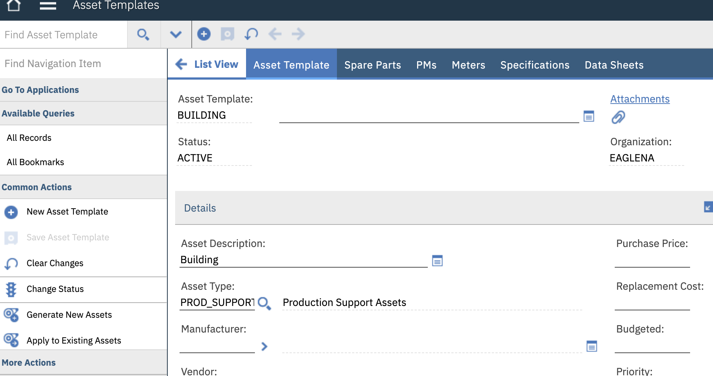
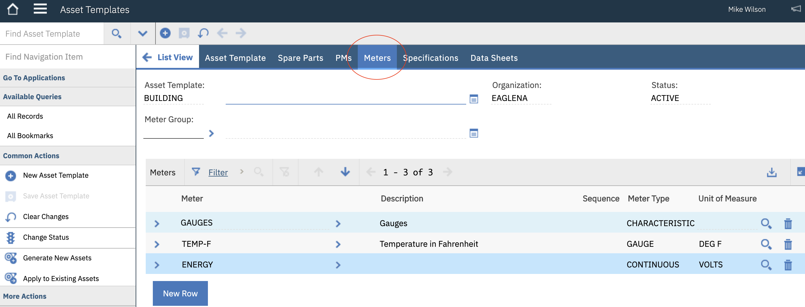
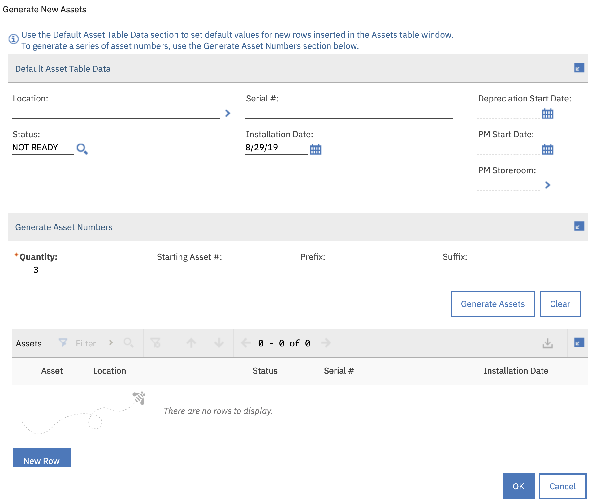
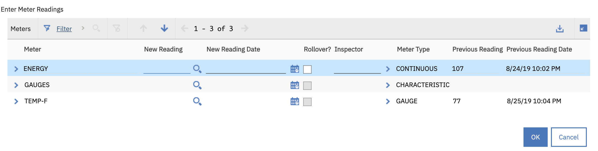
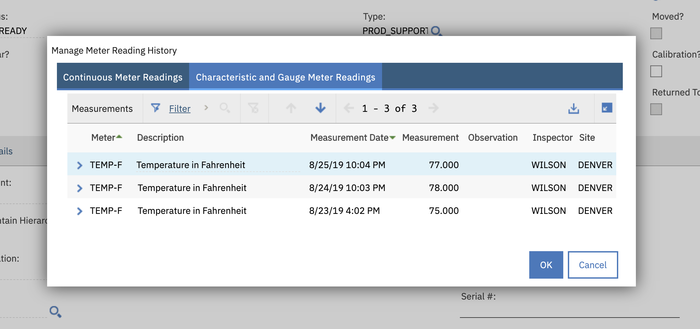
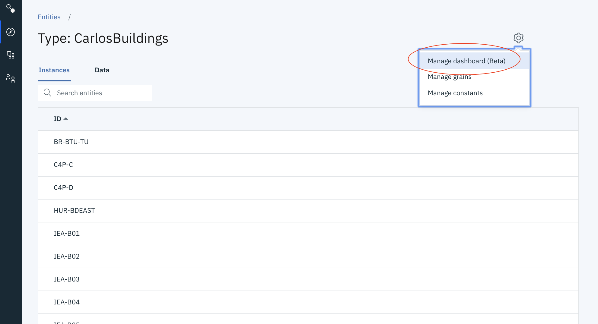
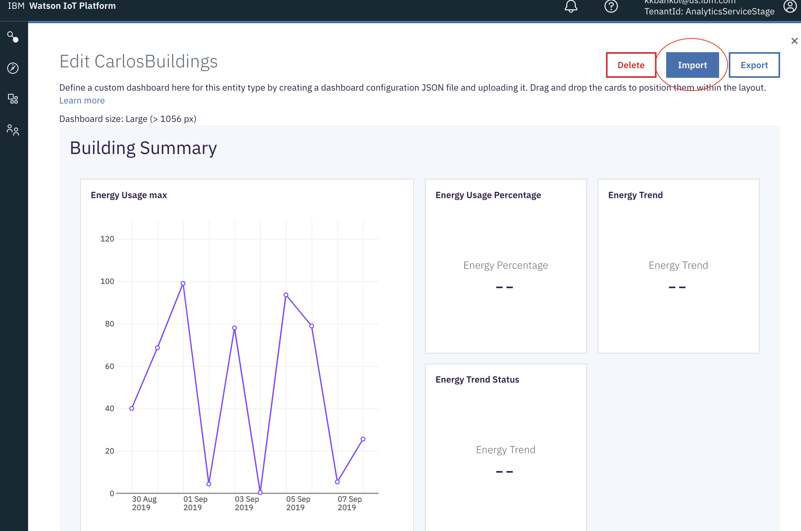
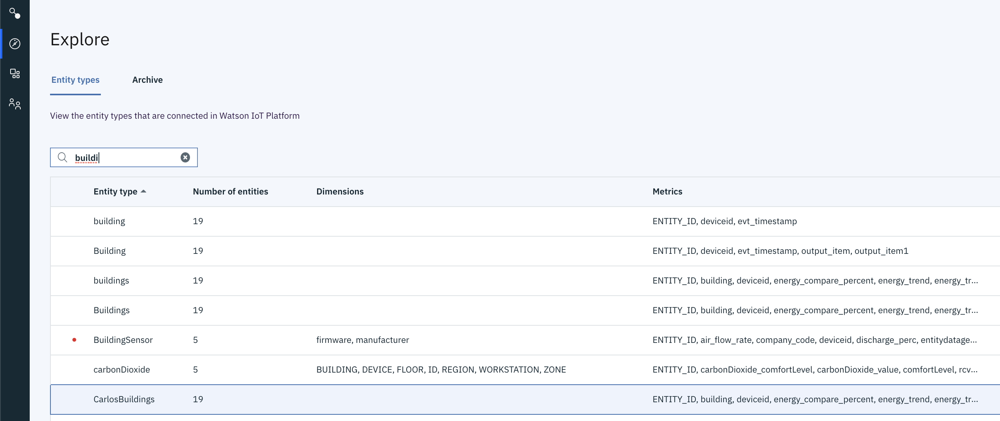
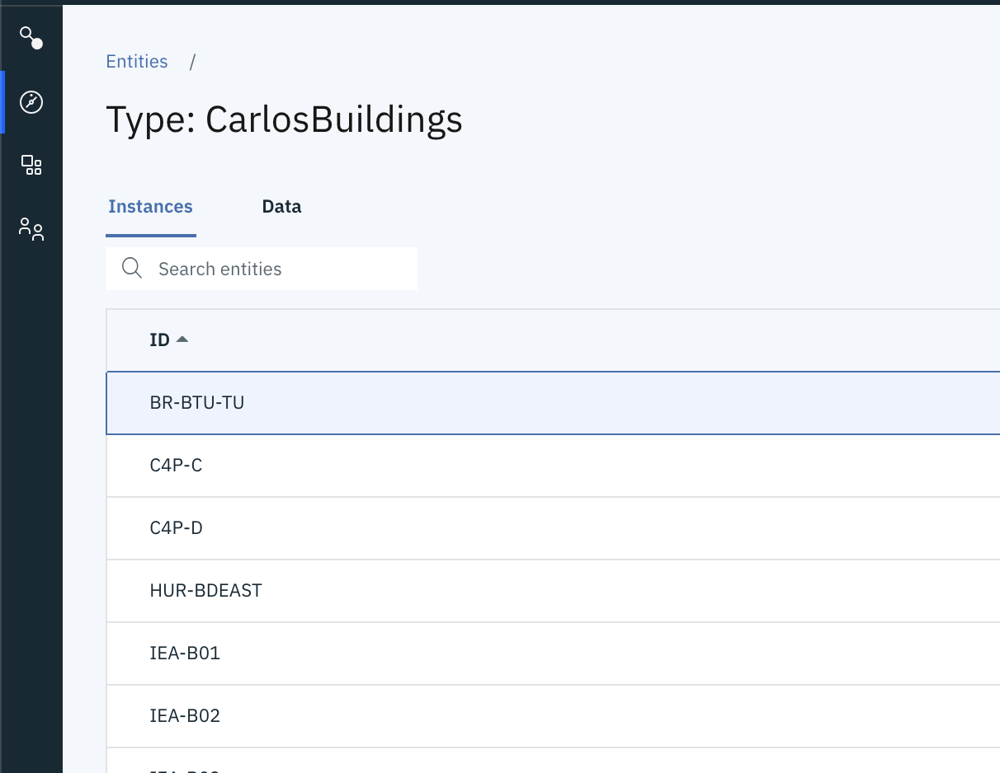
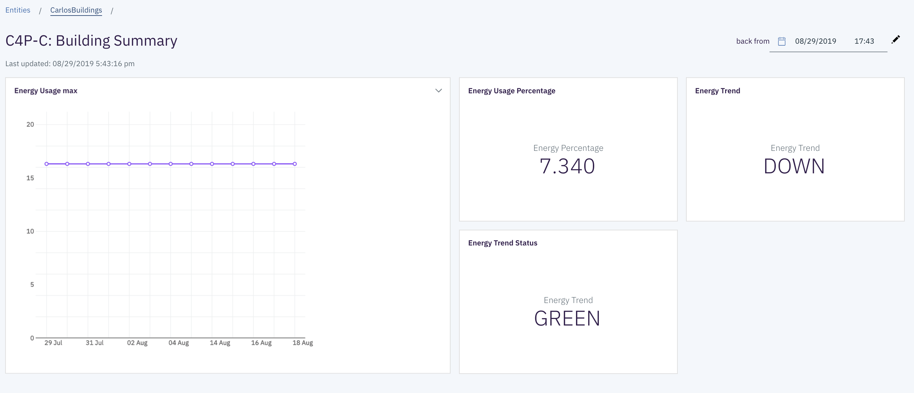

# Detect anomalies in data streamed to "Maximo Asset Monitor"

In this Code Pattern we will show how to publish data stored within an Watson IOT Platform Analytics instance to an external service. Once the data is analyzed by the service, the results can then be persisted in the Analytics Platform database.

Our specific demonstrated use case here is to detect anomalies within a Maximo Asset Monitor dataset using a scikit-learn model, which is externally hosted in a Watson Machine Learning service. We'll also demonstrate how to visualize the

When the reader has completed this Code Pattern, they will understand how to:

* Load asset data into [Watson IOT Platform Analytics](https://www.ibm.com/support/knowledgecenter/en/SSQP8H/iot/analytics/as_overview.html).
* Forward data to external services via REST HTTP call.
* Build a dashboard using [Maximo Asset Monitor](https://www.ibm.com/support/knowledgecenter/SSQP8H/iot/monitor/index.html) to monitor, visualize, and analyze IOT asset data.
* Generate alerts when certain results are received.
<!-- * Deploy, schedule and run custom Python Functions in [Watson IOT Platform Analytics](https://www.ibm.com/support/knowledgecenter/en/SSQP8H/iot/analytics/as_overview.html) to retrieve data from Maximo every 5 minutes. -->

<!-- [IBM TRIRIGA Building Insights](https://www.ibm.com/support/knowledgecenter/en/SSQP8H/iot/analytics/as_overview.html) -->
<!-- * Define Assets in -->

The intended audience for this Code Pattern are developers / data scientists who would like to analyze their data in Watson IOT Platform Analytics via customized machine learning models that are hosted externally.

<!--  -->


# Flow

1. IoT data is retrieved by function in Watson IOT Platform Analytics
2. Data is packaged as a dataframe and forwarded to a REST endpoint where custom model is hosted
3. Model results are retrieved and appended to dataset
4. Dataset is validated and committed to DB, alert is sent if anomaly is detected

<!-- 4. Schedule the function to collect asset data -->
<!-- 5. Create a Monitoring Dashboard to manage the asset -->
<!-- 6. View the Monitoring Dashboard with Building Energy Consumption -->


#  Components

* [Watson IOT Platform Analytics](https://www.ibm.com/support/knowledgecenter/en/SSQP8H/iot/analytics/as_overview.html). This is a SaaS offering that allows you to register devices, collect IOT Data and build IOT applications. This add-on service extends "Watson IoT Platform" to include [Maximo Asset Monitor](https://www.ibm.com/support/knowledgecenter/en/SSQP8H/iot/dashboard/monitoring.html). Sign up for an account [here](https://www.ibm.com/us-en/marketplace/internet-of-things-cloud/purchase)

<!-- * [Maximo](https://www.ibm.com/products/maximo). An IBM SAAS offering that allows you to register and manage assets. Sign up for a free trial [here](https://www.ibm.com/account/reg/us-en/signup?formid=urx-20869)   -->

* [HTTPPreload](https://ibm.biz/BdzvyX) This is a prebuilt analytics function that allows you to collect IOT asset and sensor data from external data sources.

* [Watson Machine Learning](https://cloud.ibm.com/catalog/services/machine-learning) This is a service that enables developers to expose their machine learning models via a REST interface.

<!-- * [Monitoring Dashboard]() Code free dashboards that allow you to monitor a variety of types of assets.  Use out of the box cards to visualize timeseries data and other asset properties. -->


# Prerequisites

* An account on IBM Marketplace that has access to Watson IOT Platform Analytics and Maximo Asset Monitor. This service can be provisioned [here](https://www.ibm.com/us-en/marketplace/internet-of-things-cloud/purchase)

* Python 3, pip

# Steps

Follow these steps to setup and run this Code Pattern.
1. [Provision cloud services](#1-provision-cloud-services)
2. [Setup your Python development environment](#2-setup-your-python-development-environment)
3. [Create an entity type](#3-create-an-entity-type)
4. [Deploy Function](#4-deploy-function)
5. [Deploy Custom Model](#5-deploy-function)
6. [View Dashboard](#6-view-dashboard)
<!-- 5. [Create a Dashboard](#4-create-dashboard) -->


## 1. Provision Cloud Services

Navigate to the IBM Cloud dashboard at [https://cloud.ibm.com/](https://cloud.ibm.com/) and click the "Catalog" button in the upper right
<p align="center">

</p>

Search for the "Watson Machine Learning" service and select the resulting icon
<p align="center">
https://i.imgur.com/tk6umPY.png
</p>

Select the pricing plan and click "Create". If deploying on an IBM Lite account, be sure to select the free "Lite" plan
<p align="center">

</p>

Click on the "Service Credentials" section. Copy and paste the generated credentials, and place them into a file in the root directory of this project titled "wml_credentials.json"
<p align="center">

</p>

Navigate back to the IBM Cloud catalog [https://cloud.ibm.com/catalog](https://cloud.ibm.com/catalog)

Search for the "Watson Studio" service and select the resulting icon
<p align="center">

</p>

Select the pricing plan and click "Create". If deploying on an IBM Lite account, be sure to select the free "Lite" plan
<p align="center">

</p>

Once the service has been provisioned, select the "Get Started" button to enter the Watson studio console
<p align="center">

</p>

Once the Watson Studio dashboard has loaded, scroll to the "Projects" section and click "New Projects" to create a project.
<p align="center">

</p>

Select a "Empty Project" as the project type
<p align="center">

</p>

Enter a project name, and then click "Create"
<p align="center">

</p>

Once the project has been created, a dashboard showing all the project assets will be displayed.

Finally, we'll need to associate our "Watson Machine Learning" service with our project. We can do so by clicking "Settings"
<p align="center">

</p>

Then, scroll down to the Associated services section. Click "Add Service" -> "Watson".
<p align="center">

</p>

Click "Machine Learning"
<p align="center">

</p>

Find your instance on the drop-down list, and then click "Select"
<p align="center">

</p>


## 2. Setup your Python development environment

### Install Python

Clone this repository
```
git clone git@github.com:IBM/maximo-anomaly.git
cd maximo-anomaly
```

Instal virtualenv if you don't have it already
```
sudo pip install virtualenv
```

Create a virtual environment
```
python3 -m venv env
```
<!-- virtualenv -p python3 env -->

### Activate Virtual Environment, Install Python Dependencies and Verify Environment
Enter your Virtual Environment directory
```
cd env
```
Activate your virtual environment
```
source bin/activate
```


### Install dependencies
```
# Prereqs
pip install numpy
pip install sqlalchemy pandas ibm_db_sa urllib3 requests lxml sklearn ibm_db python-dotenv future

# Watson IOT Functions
pip install git+https://github.com/ibm-watson-iot/functions.git@production --upgrade
pip install -r requirements.txt

# Watson Machine Learning Client
pip install watson_machine_learning_client
```


<!-- * Apply fix for DYLD (OS X only)

```
# Navigate to your preferred python installation
cd /usr/local/lib/python3.7/site-packages

``` -->
<!--
* Install Watson IOT Functions dependencies:
```
pip install git+https://github.com/ibm-watson-iot/functions.git@production --upgrade
``` -->
<!-- * Set PYTHONPATH to your project directory:
```
export PYTHONPATH="<root_project_directory>"
``` -->
<!-- * Verify that you can invoke the `local_test_of_function.py` script
```
python ./scripts/local_test_of_function.py
``` -->

## 2. Create an entity type

Copy your Watson IOT Platform Service credentials into a `credentials.json` file

Navigate to your Watson IOT Platform Analytics service.

https://dashboard-us.connectedproducts.internetofthings.ibmcloud.com/preauth?tenantid=<tenant-id>

Services > Watson IOT Platform Analytics > View Details > Copy to clipboard


If you've created a custom fork of this repo, modify your .custom/functions.py to set your PACKAGE_URL as the forked Github repository. This is necessary because the Analytics Service will need to install the custom function via pip.

`PACKAGE_URL = 'git+https://github.com/kkbankol-ibm/maximo-anomaly@'`

<!-- Change the class name if someone else has already published a function with the same name in your tenant function catalog. In this case, our class name is `InvokeExternalModel`.

```
class InvokeExternalModel(BasePreload):
``` -->

Set the PYTHONPATH to the root directory of this project

```
export PYTHONPATH=$(pwd)
```


Invoke scripts/register_entity.py. This script will create an Entity Type, and populate sample data for each column. This will also add an additional "anomaly_score" column where we can place the model results

```
python scripts/register_entity.py
```

After the entity has been registered, we'll run the following script to build and publish a model based off our custom data.

```
python scripts/register_model.py
```


The output of the previous command should include a "deployment_id" and a "model_id". Place these into your .env file as "WATSON_ML_DEPLOYMENT_ID" and "WATSON_ML_MODEL_ID"
```
python scripts/invoke_model_function.py
```


<!-- ```
python ./scripts/local_test_of_function.py
``` -->

## 3. Deploy Function
<!-- * Push function code changes to Github.
```
git add ./custom/functions.py
git commit -m "my function changes"
git push origin master
``` -->
Next, we'll add our custom function to our newly created entity via. This will enable the function to run every 5 minutes and analyze new data for anomalies. To enable the function, navigate to the "Add Data view". We can get to this form in the Analytics dashboard by selecting the following

Monitor > Entity Types > (entity name) > Data
<!--  -->

Click the `+` button and search for "InvokeExternalModel"
<p align="center">

</p>


Set values/credentials for your Maximo instance.
- URL - WML Endpoint
- apikey - "WML API key"
- model_id - "WML Model ID (should be printed after running invoke_model_function.py)"
- deployment_id - "WML Deployment ID (should be printed after running invoke_model_function.py)"
- input_features - "comma separated list of features that should be loaded from entity dataframe"

<!-- - username	- "IBM Cloud username"
- password - "IBM Cloud password" -->

<p align="center">

</p>

<!--  -->

## 4. Populate data source
Here, we'll show how to add IoT data to a data source (Maximo). In this example, we'll use a Maximo instance. We'll begin by defining an "Asset Template". This will allow us to quickly generate multiple "Assets", which will represent buildings in this case. Access this form by searching for "Asset Templates" in the "Find Navigation Item" textbox in the upper left corner.



Each Asset can have multiple associated "Meters", which are used to track sensor readings over time. We'll add a "Temperature" meter and a "Energy" meter to our template.


<!--  -->
Now that we have our asset template and associated meters defined, we can create a few building instances. We'll do this by clicking "Generate Building Assets". Provide a quantity and click "Ok".



<!--  -->
After the building assets have been created, we can then look them up by clicking on "Assets" in the upper left menu. In the upper left "Find Asset" form, enter the number of one of the newly created assets.

Once the asset page loads, we can add data to the asset, select "Enter Meter Readings" in the lower left-hand menu, under the "More Actions" section. Provide values for the meters. In this example, be sure to add "temperature" values



Confirm the meter values have be saved by clicking "Manage Meter Reading History"



<!-- Now that we have some data populated in Maximo, we'll then samp -->


<!-- TODO, explain how to upload   -->

<!-- ## 5. Create Dashboard
After populating our data source with sensor values, we can view charts corresponding to our sensor data in the dashboard

We can do this by clicking the "Explore" button on the left hand menu, and then selecting your recently created Entity

Then, click the gear in the top right > Manage dashboards


Next, click "Import"

<p align="center">

</p>



Select the file in the json directory of this project `./json/dashboardBuildingMaximo.json`

Click "Save"
* Import the dashboard layout file
```
Explore > Entity Types > Buildings > click gear top right > manage dashboards > import
```

Choose file  ./json/Staging-Dashboard.json -->


## 5. View Dashboard

Finally, we can view our dashboards by clicking the "Monitor" button on the left hand menu, and then selecting your newly created entity (maximoBuildings)

<p align="center">

</p>

Next, select the default summary dashboard
<p align="center">

</p>

This will show an overview of instance data for all registered entities.

<p align="center">

</p>

<!-- * A new Dashboard tab should appear on each entity -->
<!-- ```
Explore > Entity Types > Buildings > select an entity which is one of your buildings > Dashboard
``` -->
<!--  -->

<!-- 


Next, select an instance from that entity


And the resulting view will generate a dashboard with the latest instance data
 -->


## 6. Update Function (Optional)

If you're interested in pulling data from additional / alternative data sources, you'll need to make a few changes to the `custom/functions.py` file, which drives the IoT Analytics logic.

In our case, we first added methods to query the Maximo api
```
def getBuildings (self ):
    q_endpoint = self.url + "/maximo/oslc/os/mxasset?oslc.select=assetid&oslc.where=assettag=" + "BUILDING"
    headers = { "maxauth": self.token }
    res = requests.get(q_endpoint, headers=headers)
    return buildings
```

```
def getMeters (self, asset_id = None):
    # hardcoding id for test TODO
    asset_id = "2112"
    q_endpoint = self.url + "/maximo/oslc/os/mxasset?oslc.select=assetmeter&oslc.where=assetnum=" + asset_id
    headers = { "maxauth": self.token }
    res = requests.get(q_endpoint, headers=headers)
    meters = []
    try:
        meters = res.json()["rdfs:member"][0]["spi:assetmeter"]
        print(str(len(meters)) + " meters found")
    except:
        print("no meters found")
        pass
    return meters
```
These methods query the Maximo OSLC api to receive all buildings and meters that are associated with an Asset derived from the "Building" template

Next, we added these custom methods to the main `execute` method. The result of each method is then loaded into a `response_data` dictionary as a numpy array.

```
buildings = self.getBuildings()
response_data['building'] = np.array(buildings)
..
..
meterValues = self.getMeters()
response_data['temperature'] = np.array(meterValues)
```

Finally, commit and push these changes to git, and rerun the `local_test_of_function.py` script to register the function changes
<!-- First, in the `init` function, we'll define parameters needed to authenticate to various apis.  -->

<!-- * Push function code changes to Github. -->
```
git add ./custom/functions.py
git commit -m "my function changes"
git push origin master
```
<!-- * Update function input arguments in your Buildings Entity Type (if applicable)
```
Explore > Entity Types > Buildings > output_item > configure > next > update
``` -->

<!--  -->

# Learn more

* **Watson IOT Platform Code Patterns**: Enjoyed this Code Pattern? Check out our other [Watson IOT Platform Code Patterns](https://developer.ibm.com/?s=Watson+IOT+Platform).

* **Knowledge Center**:Understand how this Python function can load data into  [Watson IOT Platform Analytics](https://www.ibm.com/support/knowledgecenter/en/SSQP8H/iot/analytics/as_overview.html)

# License

This code pattern is licensed under the Apache Software License, Version 2.  Separate third party code objects invoked within this code pattern are licensed by their respective providers pursuant to their own separate licenses. Contributions are subject to the [Developer Certificate of Origin, Version 1.1 (DCO)](https://developercertificate.org/) and the [Apache Software License, Version 2](https://www.apache.org/licenses/LICENSE-2.0.txt).

[Apache Software License (ASL) FAQ](https://www.apache.org/foundation/license-faq.html#WhatDoesItMEAN)
